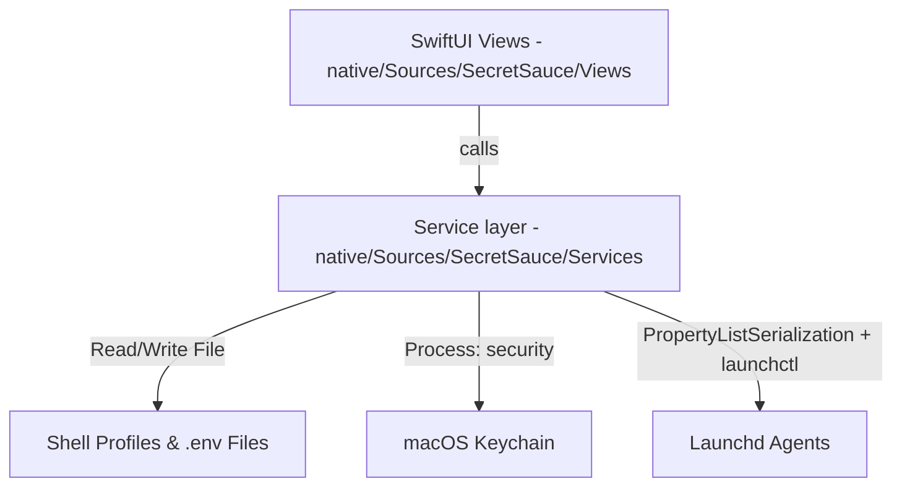

# Developer & Agent Instructions: SecretSauce Repository

Welcome! This guide is designed for developers and AI agents working on the **SecretSauce** codebase. It outlines the architecture, macOS integrations, development lifecycle, and CI/CD setup to ensure consistency and prevent errors.

---

## 📌 Technical Stack

- **App:** Native SwiftUI (macOS 13+), built with Swift Package Manager. Lives entirely in [native/](file:///Users/nico/Workspace/SecretSauce/native/).
- **Build requirements:** Only the Xcode **Command Line Tools** (`xcode-select --install`). No full Xcode, no Node, no Electron.
- **OS Integrations:** macOS Keychain and launchd are driven via the standard system binaries (`/usr/bin/security`, `/bin/launchctl`) through `Process`/`ProcessRunner`. Plists are read/written with `PropertyListSerialization`. Shell profiles and `.env` files are edited as plain text. There are no native C++ addons.
- **Dependencies:** One SPM dependency — [Sparkle](https://github.com/sparkle-project/Sparkle) (auto-update), pulled in as a universal binary framework artifact.
- **Distribution:** A single universal (arm64 + x86_64) ad-hoc-signed `.app`, ~7 MB on disk (~2 MB app + embedded Sparkle.framework).

> A small `package.json` is kept at the repo root **only** as the version source of truth for the release pipeline (see below). It is not an npm project — there are no JS dependencies.

---

## 🏗️ Project Architecture



### Service layer: `native/Sources/SecretSauce/Services/`
Each file handles one system-level concern:

- **[ShellProfileService.swift](file:///Users/nico/Workspace/SecretSauce/native/Sources/SecretSauce/Services/ShellProfileService.swift):** Parses and replaces `export KEY="value"` lines in the user's shell profile (`~/.zshrc`, `~/.bash_profile`, `~/.bashrc`, `~/.profile`), preserving comments and formatting in place.
- **[EnvFileService.swift](file:///Users/nico/Workspace/SecretSauce/native/Sources/SecretSauce/Services/EnvFileService.swift):** Serializes/deserializes `.env` key-value pairs (skips `#` comments, strips trailing ` #` comments on unquoted values, quotes values containing whitespace/quotes/`#`).
- **[KeychainService.swift](file:///Users/nico/Workspace/SecretSauce/native/Sources/SecretSauce/Services/KeychainService.swift):** Adds/deletes/reads generic passwords via `/usr/bin/security` under the service prefix `SecretSauce:`.
  - **Index File Migration:** Copies the old `~/.env-manager-keychain-index.json` to `~/.secret-sauce-keychain-index.json` if the new file does not exist yet.
  - **Read Fallback:** If `SecretSauce:<key>` is not found, it falls back to reading `EnvManager:<key>` for compatibility with pre-existing keys.
  - **Cleanup:** On delete, it removes the entry from both namespaces to prevent orphan secrets.
  - **Why the CLI:** Going through `/usr/bin/security` (rather than the SecItem API) keeps existing keychain ACLs valid, so migrated secrets don't trigger new authorization prompts.
- **[LaunchdManager.swift](file:///Users/nico/Workspace/SecretSauce/native/Sources/SecretSauce/Services/LaunchdManager.swift):** Lists launch agents from `~/Library/LaunchAgents`, reads their runtime status from `launchctl list`, edits the `EnvironmentVariables` dict in their plists, and runs load/unload/start/stop.
- **[NetworkMonitorService.swift](file:///Users/nico/Workspace/SecretSauce/native/Sources/SecretSauce/Services/NetworkMonitorService.swift):** Read-only network visibility (the monitoring half of a Little-Snitch-style tool). Parses `lsof -nP -i -F pcPnT` into connection snapshots; reverse-DNS via `/usr/bin/host` (cached); geo lookup (country/city/lat/lon) via ip-api.com's batch endpoint — the **only** code path in the app that sends data off-device, triggered on Network-tab open and on the Refresh button. ip-api.com's free tier is HTTP-only, so `package-app.sh` embeds a scoped `NSAppTransportSecurity` exception for that single domain (plain `swift run` dev builds have no Info.plist, so geo lookups may be blocked by ATS there — test geo in the packaged app). Monitoring only by design: real-time blocking needs a `NEFilterDataProvider` system extension (paid Developer ID + Apple-granted NetworkExtension entitlement + notarization + full Xcode), deliberately out of scope for the ad-hoc CLT-only build.
- **[ProcessRunner.swift](file:///Users/nico/Workspace/SecretSauce/native/Sources/SecretSauce/Services/ProcessRunner.swift):** Thin wrapper around `Process` for invoking system binaries.
- **[UpdaterService.swift](file:///Users/nico/Workspace/SecretSauce/native/Sources/SecretSauce/Services/UpdaterService.swift):** Sparkle auto-update. Wraps `SPUStandardUpdaterController` and exposes a "Check for Updates…" menu item (`CommandGroup(after: .appInfo)` in `SecretSauceApp`). The updater only starts when running as a packaged `.app` (it checks for `SUFeedURL` in the bundle Info.plist); bundle-less `swift run` dev builds get a no-op updater, so no Sparkle errors in dev.
  - **Update mechanism:** Updates are verified by **EdDSA signature** (`SUPublicEDKey` in Info.plist), not Developer ID — so ad-hoc signing is fine. Sparkle strips quarantine from installed updates, so auto-updates launch clean even though the *first* manual download still hits Gatekeeper (same `xattr -cr` workaround).
  - **Feed:** `SUFeedURL` → `https://github.com/NicoBraun93/SecretSauce/releases/latest/download/appcast.xml`. `releases/latest/download/` always resolves to the newest release's `appcast.xml` asset.
  - **Signing keys:** one EdDSA keypair (generated once with Sparkle's `generate_keys`). Public half lives in the Info.plist (`package-app.sh`); private half is the GitHub Actions secret `SPARKLE_ED_PRIVATE_KEY` and never leaves CI / the login keychain.

### UI: `native/Sources/SecretSauce/Views/`
- **[ContentView.swift](file:///Users/nico/Workspace/SecretSauce/native/Sources/SecretSauce/Views/ContentView.swift):** `NavigationSplitView` with a sidebar selecting the six sections.
- **Sections:** `LocalEnvView`, `ShellProfileView`, `EnvFilesView`, `KeychainView`, `LaunchdView`, `NetworkView`.
- **[VarTableView.swift](file:///Users/nico/Workspace/SecretSauce/native/Sources/SecretSauce/Views/VarTableView.swift):** Reusable key/value table (search, add, inline edit, delete, secret reveal, persist badges) shared by all tabs.
- **[NetworkView.swift](file:///Users/nico/Workspace/SecretSauce/native/Sources/SecretSauce/Views/NetworkView.swift):** Network Monitor tab. Snapshot + geo lookup on tab-open and on the Refresh button (no polling). Table columns size from available width (`ColWidths`) so the window can be squeezed without clipping. Click a map dot to filter the table to that location (filter chip next to search clears it); hover for an info card. The location filter applies to the table only — map pins always derive from the unfiltered (search + remote-only) set, or selecting one dot would hide the rest.
- **[ConnectionMapView.swift](file:///Users/nico/Workspace/SecretSauce/native/Sources/SecretSauce/Views/ConnectionMapView.swift):** `NSViewRepresentable` wrapping AppKit's `MKMapView`. Pulsing "This Mac" home pin, endpoint dots with halo/caption/count, animated dashed geodesic arcs, hover via `NSTrackingArea` (owner is a weak-forwarding `HoverOwner`, never the view itself — `NSTrackingArea` retains its owner, so `owner: self` leaks every annotation view), click selection via `didSelect`/`didDeselect`. Annotation rebuilds mute selection callbacks and re-select the previously selected dot so a data refresh doesn't clear the user's table filter.
  - **Arc rendering — do NOT move back to MKOverlayRenderer animation:** arcs live in a single click-through `CAShapeLayer` hosted above the map, re-projected on `mapViewDidChangeVisibleRegion`; the dash flow is a repeating `CABasicAnimation` on `lineDashPhase` (GPU-side, zero redraws). The previous implementation (20 fps `Timer` calling `setNeedsDisplay(.world)` on per-overlay renderers) re-rasterized overlay tiles at every zoom scale faster than MapKit could draw them — unbounded memory growth that filled 125 GB of swap.

---

## 💻 Developer Commands

### Dev Mode
```bash
cd native && swift run
```

### Packaging the `.app`
Builds arm64 + x86_64 release slices, lipo-merges them into a universal binary, assembles `release/SecretSauce.app` with an `Info.plist`, and ad-hoc signs it:

```bash
npm run package        # alias for: bash native/package-app.sh
```

> Note: multi-arch `swift build --arch arm64 --arch x86_64` in a single invocation requires full Xcode (xcbuild), so the script builds each slice separately and merges with `lipo`. This keeps it working with only the Command Line Tools.

The script also **embeds Sparkle.framework** for auto-update: it `ditto`s the universal `Sparkle.framework` (from the SPM binary artifact under `native/.build/artifacts/`) into `Contents/Frameworks/`, adds an `@executable_path/../Frameworks` rpath to the main binary via `install_name_tool`, injects `SUFeedURL` + `SUPublicEDKey` into the Info.plist, then **signs inside-out** (`codesign --deep` the framework first, then the app). Do NOT drop the deep-sign or the rpath — without them the app fails to load Sparkle at launch.

### App Icon
The icon is generated entirely in code — no design tools or binary source art to maintain. [native/Resources/make-icon.swift](file:///Users/nico/Workspace/SecretSauce/native/Resources/make-icon.swift) draws the brand motif with CoreGraphics: an electric-blue droplet (`#3b82f5`) with an empty keyhole cut-out, on a solid near-black tile (`#0d0f12`) with a subtle blue glow — colors and style follow the shared design system in `~/Workspace/Design_System/foundations` (dark-first, no gradients, glow as elevation cue). Regenerate with `bash native/make-icon.sh`, which writes `native/Resources/AppIcon.icns` (bundled by `package-app.sh`) and `native/Resources/icon.png` (used in the README). `package-app.sh` regenerates the `.icns` automatically if it is missing.

In-app colors use the same tokens via the adaptive `Color.ds*` definitions in [Theme.swift](file:///Users/nico/Workspace/SecretSauce/native/Sources/SecretSauce/Theme.swift); the UI follows the system light/dark appearance (no forced color scheme).

### Gatekeeper Workaround (Local builds)
Unsigned/ad-hoc-signed apps are blocked on first launch. Clear the Gatekeeper flags with:

```bash
xattr -cr release/SecretSauce.app
```

---

## 🚀 CI/CD Release Pipeline

We use a GitHub Actions workflow defined in [.github/workflows/release.yml](file:///Users/nico/Workspace/SecretSauce/.github/workflows/release.yml) to automatically release new versions.

### Versioning Logic
On every push to the `main` branch:
1. Reads `version` from `package.json`.
2. Checks if git tag `v<version>` exists.
3. If it **exists**, increments the patch version (e.g. `1.0.0` → `1.0.1`), updates `package.json` in the build runner workspace, tags the commit, and pushes the tag to GitHub.
4. If it **does not exist**, tags the current commit as `v<version>` and pushes it.
5. Builds the native universal app via `native/package-app.sh` (which stamps the determined version into the bundle's `Info.plist`).
6. Compresses `release/SecretSauce.app` into `SecretSauce-mac-universal.zip` using `ditto` (preserving symlinks, signature, and metadata).
7. **Generates the Sparkle `appcast.xml`**: runs `generate_appcast` (from the built Sparkle artifact) over the zip, EdDSA-signing it with the `SPARKLE_ED_PRIVATE_KEY` secret and pointing each enclosure at this release's `releases/download/<tag>/` asset URL.
8. Uploads **both** `SecretSauce-mac-universal.zip` and `appcast.xml` to the GitHub Release. Because `SUFeedURL` uses `releases/latest/download/appcast.xml`, installed apps always see the newest release's feed.

### Workflow Configuration Notice
For the pipeline to succeed:
- **Workflow permissions** under **Settings → Actions → General** must be **"Read and write permissions"** so the runner can push the generated git tags and publish the release.
- The repo secret **`SPARKLE_ED_PRIVATE_KEY`** (Settings → Secrets and variables → Actions) must hold the EdDSA private key that matches the `SUPublicEDKey` baked into the app. Without it the appcast step fails (updates can't be signed). Rotate by regenerating the keypair (`generate_keys`), updating both the secret and the `SUPublicEDKey` in `package-app.sh` — note that changing the public key breaks updates for already-installed older versions.
