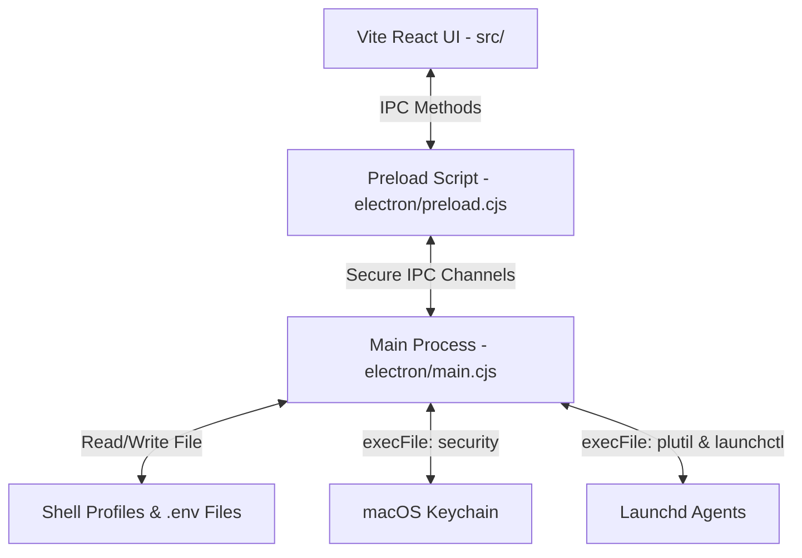

# Developer & Agent Instructions: EnvManager Repository

Welcome! This guide is designed for developers and AI agents working on the **EnvManager** codebase. It outlines the architecture, macOS integrations, development lifecycle, and CI/CD setup to ensure consistency and prevent errors.

---

## 📌 Technical Stack

- **Frontend:** React 18 (TypeScript), Vite 5, Vanilla CSS (Premium outfit font and JetBrains Mono fonts, dark theme).
- **Desktop Wrapper:** Electron 32.
- **OS Integrations:** Executed via standard macOS binaries (`/usr/bin/security`, `/usr/bin/plutil`, `/bin/launchctl`) called from the Electron main process via `child_process.execFile`. No native C++ Node addons are used, simplifying builds and cross-compilation.

---

## 🏗️ Project Architecture



### 1. Main Process: [electron/main.cjs](file:///Users/nico/Workspace/EnvManager/electron/main.cjs)
Handles system-level actions:
- **Shell Profile editing:** Parses and replaces `export KEY="value"` in profile files.
- **`.env` parsing:** Serializes/deserializes env variables.
- **macOS Keychain:** Spawns `/usr/bin/security` to add, delete, and read generic passwords under the service prefix `EnvManager:`. Synchronizes keys using `~/.env-manager-keychain-index.json`.
- **Launchd Plist files:** Spawns `/usr/bin/plutil` to convert XML plists in `~/Library/LaunchAgents` to JSON for reading and vice versa for writing. Spawns `/bin/launchctl` for agent control (`load`, `unload`, `start`, `stop`).

### 2. Preload Script: [electron/preload.cjs](file:///Users/nico/Workspace/EnvManager/electron/preload.cjs)
Exposes safe renderer APIs through `contextBridge.exposeInMainWorld("api", ...)` to prevent raw Node.js access in the frontend.

### 3. Frontend UI: [src/](file:///Users/nico/Workspace/EnvManager/src/)
- [App.tsx](file:///Users/nico/Workspace/EnvManager/src/App.tsx): Central layout with navigation sidebar.
- **Tabs:** Individual tabs manage Shell profiles, `.env` files, macOS Keychain, and Launchd configurations.

---

## 💻 Developer Commands

### Dev Mode
Starts Vite dev server and then launches Electron pointing to localhost:

```bash
# Terminal 1:
npm run dev

# Terminal 2:
npx electron .
```

### Packaging Target Binaries (macOS)
Creates a standalone unsigned `.app` inside the `release/` folder.

- **Apple Silicon (M1/M2/M3/M4):** `npm run package:mac-arm`
- **Intel Macs:** `npm run package:mac-x64`

### Gatekeeper Workaround (Local builds)
Unsigned apps are blocked on first launch. Clear the Gatekeeper flags with:

```bash
xattr -cr release/EnvManager-darwin-*/EnvManager.app
```

---

## 🚀 CI/CD Release Pipeline

We use a GitHub Actions workflow defined in [.github/workflows/release.yml](file:///Users/nico/Workspace/EnvManager/.github/workflows/release.yml) to automatically release new versions.

### Versioning Logic
On every push to the `main` branch:
1. Reads `version` from `package.json`.
2. Checks if git tag `v<version>` exists.
3. If it **exists**, increments the patch version (e.g. `1.0.0` to `1.0.1`), updates `package.json` in the build runner workspace, tags the commit, and pushes the tag to GitHub.
4. If it **does not exist**, tags the current commit as `v<version>` and pushes it.
5. Builds and packages both `arm64` and `x64` macOS platforms.
6. Packages them into ZIP files using `zip -y -r` (preserving symlinks) and uploads them to a GitHub Release.

### Workflow Configuration Notice
For the pipeline to succeed, make sure that **Workflow permissions** under your repository's **Settings -> Actions -> General** are set to **"Read and write permissions"** so the runner can push the generated git tags and publish the release.
